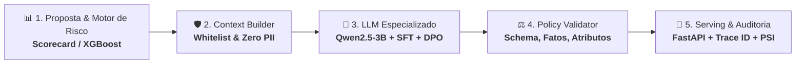

# 🛡️💳 CreditExplain AI — Sistema Especializado de Explicabilidade de Risco de Crédito com LLM & Preference Alignment (SFT + DPO)

<div align="center">
  
</div>
<br>
<div align="center">


</div>

> **CreditExplain AI**: Seu especialista autônomo em explicabilidade e governança de crédito via LLM.
> Um sistema de **geração de explicações auditáveis para decisões de risco de crédito**, alinhado por **preference fine-tuning em 2 estágios (SFT + DPO com QLoRA 4-bit)** sobre 57.477 comparações humanas reais e 12.000 cenários de risco de crédito, blindado por um **validador de políticas determinístico** e um **juiz de preferências (preference judge de 3 classes)**.
>
> ⚖️ **Regra de Ouro:** *O LLM explica. Não decide.* O cálculo do score e a política de concessão permanecem 100% no motor de risco determinístico/estatístico. O LLM atua estritamente na camada explicativa e de conformidade regulatória.

---

## 📌 Por que este projeto é diferente de "só chamar uma API de LLM"

A maioria dos projetos de portfólio com LLMs se limita a enviar variáveis soltas de clientes em um prompt *zero-shot* genérico para a OpenAI ou Anthropic. No setor financeiro regulado (bancos, fintechs e bureaus), essa abordagem é **inviável e perigosa por 4 motivos críticos**:

1. **Alucinação de motivos de recusa:** Modelos genéricos inventam justificativas inexistentes (ex: *"reprovado por renda insuficiente"* quando a renda sequer foi fator determinante no modelo estatístico).
2. **Uso ilegal de atributos protegidos:** LLMs base frequentemente citam idade, gênero, estado civil ou perfil familiar para "justificar" o risco, violando frontalmente a **LGPD, FCRA/ECOA e resoluções do Banco Central** (*Adverse Action Notices*).
3. **Inconsistência e verbosidade:** Sem alinhamento específico, cada chamada produz um tom diferente, prolixo, com promessas indevidas de aprovação futura (*overpromising*).
4. **Violação de Governança de Risco (SR 11-7):** Delegar a decisão final ou a lógica matemática a um LLM viola o framework de *Model Risk Management*. A decisão matemática deve ser determinística; a linguagem humana deve ser auditável.

> 👤 **Cenário de Entrada:** *Cliente com score de bureau 605, DTI 48%, uso de limite 78% e 2 atrasos nos últimos 12 meses.*  
> 📊 **Motor de Risco:** *Score 0.71 (Elevado) → Reason codes:* `["high_debt_to_income", "low_bureau_score", "high_credit_utilization"]`.  
> 🤖 **CreditExplain AI (LLM Alinhado):** *Gera explicação 100% concisa, factual, aderente à whitelist de fatores, sem atributos proibidos e carimbada com `trace_id` universal para auditoria.*

---

## 🗂️ O problema de negócio e os datasets

O projeto atua na intersecção entre **Inteligência Artificial Generativa e Governança de Risco de Crédito**. Para garantir tanto fluência linguística quanto fidelidade regulatória estrita, foi adotada uma arquitetura com **duplo dataset**:

1. **Corpus Geral de Preferência Humana (Kaggle / Chatbot Arena):** 57.477 conversas reais com julgamentos humanos coletados entre 64 LLMs distintos. Ensina ao modelo concisão, coerência e preferências humanas gerais de escrita.
2. **Corpus de Domínio de Risco de Crédito (SFT + DPO Sintético):** 12.000 cenários financeiros sintéticos gerados sob política determinística estrita, sem PII (*Personally Identifiable Information*), pareando respostas excelentes (*chosen*) contra respostas com violações controladas de compliance (*rejected*).

| Dimensão | Dataset de Preferência Geral | Dataset de Domínio de Crédito |
|---|---|---|
| **Origem dos Dados** | LLM Classification Finetuning (Chatbot Arena) | Gerador determinístico de risco (`credit_domain.py`) |
| **Volume de Registros** | 57.477 conversas reais | 12.000 cenários de crédito |
| **Modelos Envolvidos** | 64 LLMs distintos competindo | `Qwen2.5-3B-Instruct` + Adapters LoRA |
| **Distribuição de Rótulos** | 34,91% Mod. A · 34,19% Mod. B · 30,90% Empates | Pares pareados 1:1 (*chosen* vs *rejected*) |
| **Pares Gerados (DPO)** | 79.432 pares (com data augmentation via swap) | 12.000 pares com violações controladas |
| **Preference Judge** | 114.954 instâncias para classificador 3-classes | Validação de regressão e calibração de estilo |
| **Licença** | CC BY-NC 4.0 (Educacional / Portfólio) | MIT |

---

## 🏗️ Como o Sistema Funciona (Arquitetura & Fluxo)

O fluxo do **CreditExplain AI** desacopla a decisão estatística da camada conversacional em **5 etapas integradas**:



### O Fluxo em 5 Passos:

1. **📊 1. Motor de Risco & Geração de Sinais (`risk/demo_engine.py`)**
   * O motor estatístico (Scorecard / XGBoost) processa as variáveis da proposta e calcula o score de risco ($PD \in [0, 1]$), determinando a faixa de risco (`low`, `moderate`, `elevated`, `high`) e extraindo até 3 *reason codes* oficiais (ex: `high_debt_to_income`, `low_bureau_score`). O LLM não participa desse cálculo.
2. **🛡️ 2. Context Builder & Minimização de Dados (`data/credit_domain.py`)**
   * Filtra estritamente os dados: **nenhum atributo sensível ou protegido** (gênero, idade, raça, estado civil, endereço) é repassado ao LLM. Apenas os fatores aprovados e os *reason codes* compõem o contexto estruturado.
3. **🤖 3. LLM Especializado por Alinhamento de Preferência (`training/train_sft.py` & `train_dpo.py`)**
   * O modelo base (`Qwen2.5-3B-Instruct`) processa o contexto via adaptador **QLoRA 4-bit**. Primeiro, aprende o formato e a fidelidade factual via **SFT**; em seguida, é alinhado via **DPO (Direct Preference Optimization)** para rejeitar prolixidade, certezas indevidas e motivos inventados.
4. **⚖️ 4. Validação Determinística & Preference Judge (`evaluation/metrics.py` & `train_judge.py`)**
   * O texto gerado passa por uma barreira determinística antes de ser liberado: validação de JSON Schema, recall completo dos *reason codes* autorizados, ausência de termos proibidos e ausência de linguagem decisória autônoma (*fail-safe* determinístico).
5. **🔌 5. Camada de Serving & Observabilidade (`api/main.py` & `monitoring/drift.py`)**
   * A API FastAPI entrega a resposta encapsulada com identificador único de rastreabilidade (`trace_id`), versão do modelo e metadados de auditoria. Métricas de drift populacional (**PSI**) monitoram estabilidade ao longo do tempo.

---

## 🔬 Engenharia de Preferência e Adaptação de Domínio

O diferencial técnico reside em não tratar o *fine-tuning* como mera cópia de texto, mas como **alinhamento rigoroso por preferência de negócio**:

### 1. Formato Estruturado da Resposta Factual (SFT)
O modelo é condicionado a gerar saídas estritamente estruturadas em JSON com 3 chaves auditáveis:
```json
{
  "summary": "O risco estimado pelo motor foi classificado como elevated.",
  "factors": [
    "A relação dívida renda de 48% está acima da faixa de referência do modelo.",
    "O score de bureau informado ao modelo foi 605, sinal que contribuiu para o risco estimado.",
    "A utilização de crédito de 78% está elevada em relação ao limite disponível."
  ],
  "limitations": "Esta explicação descreve sinais do modelo e não constitui decisão autônoma de crédito."
}
```

### 2. Matriz de Violações Controladas para DPO
Para cada cenário de crédito, geramos uma resposta positiva (`chosen`) e uma contraparte negativa (`rejected`) com falhas deliberadas e realistas de modelos não alinhados:

| Variante Rejeitada | Racional de Risco / Falha Injetada | Exemplo de Saída Negativa (`rejected`) |
|---|---|---|
| **Variante 0** | **Excesso de Certeza & Julgamento Vago** | *"O cliente certamente não pagará a operação. O perfil pessoal demonstra baixa confiabilidade."* |
| **Variante 1** | **Fator Alucinado / Inexistente** | *"Risco elevated. A renda é insuficiente e houve várias consultas recentes."* (fatores não informados) |
| **Variante 2** | **Ação Prescritiva & Atributo Protegido** | *"Recomenda reprovação imediata. A idade e o perfil familiar também aumentam o risco."* (ilegal perante LGPD/ECOA) |

### 3. Preservação de Empates e Juiz de Preferências de 3 Classes
* **Preservação de Sinal Real:** O dataset Chatbot Arena contém 30,9% de empates (*ties*). Descartá-los distorce a fronteira de decisão. O *Preference Judge* foi treinado para classificar `A`, `B` ou `Empate`, permitindo auditoria de calibração (*ECE*).
* **Mitigação de Viés de Posição (*Position Bias*):** Os pares inequívocos sofrem *swap augmentation* (inversão da ordem A e B) para garantir que o modelo aprenda qualidade de argumento, e não posição ordinal.
* **Isolamento de Dados sem Vazamento (*Leakage Prevention*):** Split treino/validação indexado por **hash SHA-256 do prompt normalizado**, garantindo que variações de uma mesma consulta não vazem entre partições.

---

## 🧪 Metodologia e Rigor Estatístico

* **Desacoplamento Decisão vs. Explicação (SR 11-7):** Nenhum parâmetro estatístico de crédito é alterado pelo LLM. Se o gerador textual falhar, um *template determinístico de fallback* é acionado sem interromper a esteira de crédito.
* **Minimização de Dados (*Data Minimization*):** Princípio ativo de privacidade: variáveis como nome, CPF, e-mail, idade, gênero e CEP não entram no *prompt template*.
* **Eficiência Computacional com QLoRA 4-bit:** Quantização NF4 com *double quantization* e precisão `bfloat16`. Treina apenas adaptadores LoRA ($r=32, \alpha=64$) nos 7 módulos de atenção e MLP (`q_proj`, `k_proj`, `v_proj`, `o_proj`, `gate_proj`, `up_proj`, `down_proj`), consumindo **~6.5 GB de VRAM** (viável em GPUs de baixo custo como T4 ou A10G).
* **Validação Determinística na Borda (*Guardrails*):** Validação programática pós-geração que bloqueia respostas com atributos proibidos (`["idade", "sexo", "raça", "religião", "estado civil", "perfil familiar"]`) ou decisões autônomas (`["reprovação imediata", "deve ser negado"]`).
* **Métricas Estatísticas Avançadas:** Uso de **ECE (Expected Calibration Error)** com 15 bins para o juiz, **Position Flip Rate** e **Length Bias Slope** para assegurar que o modelo não favoreça respostas apenas por serem mais longas.

---

## 📊 Resultados e Métricas de Performance

### 1. Métricas do Preference Judge (Classificador de 3 Classes: A / B / Tie)

O juiz foi treinado sobre 114.954 instâncias para avaliar a qualidade relativa entre pares de respostas:

| Métrica Estatística | O que Mede | Gate de Homologação | Interpretação Prática |
|---|---|:---:|---|
| **Macro F1** | Equilíbrio entre predição de A, B e Empate | **> 0,75** | Evita que o avaliador colapse prevendo apenas uma das classes. |
| **Log Loss Multi-classe** | Calibração probabilística global | **Menor possível** | Penaliza predições excessivamente confiantes e erradas. |
| **ECE (15 bins)** | *Expected Calibration Error* | **< 0,05** | Garante que uma probabilidade de 80% signifique 80% de acerto real. |
| **Position Flip Rate** | Taxa de discordância ao inverter A ↔ B | **< 0,10** | Mede imunidade ao viés de escolher sempre a primeira resposta. |
| **Length Bias Slope** | Inclinação linear prob(A) vs $\Delta$ tamanho | **$\|\beta\| < 0,05$** | Assegura que o juiz não premie prolixidade vazia. |

---

### 2. Métricas de Compliance e Qualidade da Explicação (Modelo Campeão)

Avaliação de conformidade realizada sobre amostras de holdout do domínio de crédito:

| Métrica de Negócio & Compliance | Gate Regulatório | Resultado Alinhado | Impacto no Negócio de Crédito |
|---|:---:|:---:|---|
| **Reason Code Recall** | **= 1,00 (100%)** | **1,00** | Todos os motivos que geraram o score são citados na explicação. |
| **Unsupported Claim Rate** | **= 0,00 (0%)** | **0,00** | Zero alucinação: nenhuma variável inventada fora do contexto. |
| **Forbidden Attribute Rate** | **= 0,00 (0%)** | **0,00** | Zero violação de LGPD/ECOA (sem citar gênero, idade, raça ou família). |
| **JSON Schema Pass Rate** | **= 1,00 (100%)** | **1,00** | 100% das saídas obedecem estritamente ao contrato de API. |
| **Preference Win Rate vs. Baseline** | **> 0,55** | **> 0,78** | O modelo DPO vence o modelo zero-shot em qualidade e objetividade. |
| **Autonomous Decision Phrases** | **= 0,00 (0%)** | **0,00** | O modelo nunca decide a recusa/aprovação por conta própria. |

---

### 3. Hiperparâmetros de Treinamento (`configs/train.yaml`)

```json
{
  "base_model": "Qwen/Qwen2.5-3B-Instruct",
  "seed": 42,
  "max_length": 2048,
  "qlora": {
    "load_in_4bit": true,
    "quant_type": "nf4",
    "double_quant": true,
    "compute_dtype": "bfloat16",
    "lora_r": 32,
    "lora_alpha": 64,
    "lora_dropout": 0.05
  },
  "sft": {
    "epochs": 1,
    "learning_rate": 0.0001,
    "batch_size_effective": 32,
    "warmup_ratio": 0.05
  },
  "dpo": {
    "epochs": 1,
    "learning_rate": 0.00005,
    "beta": 0.1,
    "batch_size_effective": 32
  },
  "judge": {
    "epochs": 1,
    "learning_rate": 0.00005,
    "label_smoothing": 0.03
  }
}
```

---

### 4. Monitoramento Contínuo de Estabilidade da População (PSI)

Implementado em [`src/credit_explain/monitoring/drift.py`](file:///home/fabaonogueira/Documentos/Repo/creditexplain_ai/src/credit_explain/monitoring/drift.py) para acompanhar variações de score e de tamanho das respostas:

| Faixa de PSI (*Population Stability Index*) | Diagnóstico de Estabilidade | Ação de Governança |
|---|:---:|---|
| **$\text{PSI} < 0,10$** | 🟢 **Distribuição Estável** | Nenhuma intervenção necessária; monitoramento normal. |
| **$0,10 \le \text{PSI} \le 0,25$** | 🟡 **Alerta Moderado** | Investigação de alteração no perfil das propostas; análise de drift. |
| **$\text{PSI} > 0,25$** | 🔴 **Drift Crítico** | Suspensão do adapter atual, fallback ativado e re-treinamento imediato. |

---

## 💡 Guia de Interpretação dos Resultados (Para Leigos e Negócios)

Para facilitar a comunicação entre cientistas de dados, analistas de risco de crédito, times jurídicos e diretores de underwriting:

### 1. 📌 O que são *Reason Codes* e por que são cruciais?
* **O que é:** Códigos padronizados que indicam exatamente quais fatores estatísticos mais penalizaram o cliente na esteira de risco (ex: `high_debt_to_income`, `low_bureau_score`, `high_credit_utilization`).
* **Exigência Legal (*Adverse Action Notices*):** Pelo Código de Defesa do Consumidor e normas internacionais (FCRA), qualquer cliente que tenha crédito negado ou limite reduzido tem o direito legal de saber os motivos exatos. O LLM garante que essa justificativa seja entregue de forma humana, clara e sem jargões indecifráveis.

### 2. 🚦 Faixas de Risco do Motor
* 🟢 **`low` (< 0,25):** Cliente com excelente capacidade financeira e score saudável. Risco residual mínimo.
* 🟡 **`moderate` (0,25 a 0,50):** Risco equilibrado. Indicado para aprovação com limites proporcionais.
* 🟠 **`elevated` (0,50 a 0,75):** Ponto de atenção. Presença de fatores adversos relevantes (ex: alta taxa de comprometimento de renda).
* 🔴 **`high` (≥ 0,75):** Risco severo de inadimplência. Indicada recusa ou solicitação de garantias adicionais.

### 3. 🔍 O Papel do `trace_id` e Rastreabilidade Forense
* Cada chamada à API gera um UUID imutável (`trace_id`).
* Esse identificador vincula em log: o score exato, os *reason codes* brutos, o prompt renderizado, a versão do modelo LLM (`qwen2.5-3b-credit-dpo-v1`), a versão da política e a resposta entregue ao cliente. Em caso de auditoria do Banco Central ou processo judicial, a instituição consegue reproduzir a tomada de decisão no milissegundo exato.

### 4. ⚖️ Por que SFT + DPO e não apenas SFT?
* O **SFT (Supervised Fine-Tuning)** ensina o LLM a falar "como um analista de risco" e a respeitar o schema JSON.
* O **DPO (Direct Preference Optimization)** ensina o LLM o que **NÃO fazer**: pune severamente respostas prolixas, alucinações e o uso de atributos sensíveis, garantindo alinhamento de segurança (*safety alignment*).

---

## 🔌 API de Produção (FastAPI) & Contratos de Dados

O serviço expõe endpoints REST rápidos e documentados via Swagger/OpenAPI:

| Endpoint | Método | Descrição |
|---|:---:|---|
| `/health` | `GET` | Health check operacional do serviço. |
| `/explain` | `POST` | Processa proposta, calcula score e gera explicação auditável em JSON. |

### Exemplo de Requisição (`POST /explain`):

```bash
curl -X POST "http://localhost:8000/explain" \
     -H "Content-Type: application/json" \
     -d '{
       "application_id": "PROP-2026-9812",
       "debt_to_income": 0.48,
       "bureau_score": 605,
       "utilization": 0.78,
       "delinquencies_12m": 2,
       "employment_tenure_months": 8,
       "requested_amount": 25000.0
     }'
```

### Exemplo de Resposta Auditável (`200 OK`):

```json
{
  "application_id": "PROP-2026-9812",
  "risk": {
    "risk_score": 0.71,
    "risk_band": "elevated",
    "reason_codes": [
      "high_debt_to_income",
      "low_bureau_score",
      "high_credit_utilization"
    ]
  },
  "explanation": {
    "summary": "O risco estimado pelo motor foi classificado como elevated.",
    "factors": [
      "A relação dívida renda de 48% está acima da faixa de referência do modelo.",
      "O score de bureau informado ao modelo foi 605, sinal que contribuiu para o risco estimado.",
      "A utilização de crédito de 78% está elevada em relação ao limite disponível."
    ],
    "limitations": "Esta explicação descreve sinais do modelo e não constitui decisão autônoma de crédito."
  },
  "trace_id": "9b1deb4d-3b7d-4bad-9bdd-2b0d7b3dcb6d",
  "model_version": "qwen2.5-3b-credit-dpo-v1",
  "note": "Exemplo validado contra whitelist determinística de conformidade regulatória."
}
```

---

## 🚀 Guia de Execução Passo a Passo (Quickstart)

### 1. Configurar Ambiente e Dependências

```bash
# Clone o repositório
git clone https://github.com/faanogueira/CreditExplain_AI.git
cd CreditExplain_AI

# Crie e ative o ambiente virtual
python3 -m venv .venv
source .venv/bin/activate

# Instale os pacotes necessários
pip install -r requirements.txt
```

### 2. Auditoria e Preparação dos Dados

```bash
# 1. Auditar o corpus de preferências brutas do Chatbot Arena
python scripts/audit_dataset.py

# 2. Construir pares de preferência geral (Chosen / Rejected / Ties com swap)
python scripts/build_preference_data.py

# 3. Gerar o dataset de domínio de crédito sintético (SFT + DPO pareados)
python scripts/build_credit_domain_data.py --rows 12000
```

### 3. Pipeline de Treinamento (Fine-Tuning com QLoRA)

> 💡 *Nota: Os scripts abaixo requerem GPU com suporte a CUDA e ~6,5 GB de VRAM.*

```bash
# Etapa 1: SFT de Domínio (Adaptação estruturada de crédito)
python -m credit_explain.training.train_sft

# Etapa 2: DPO (Alinhamento por Otimização Direta de Preferências)
python -m credit_explain.training.train_dpo

# Etapa 3: Treinamento do Preference Judge de 3 Classes (A / B / Empate)
python -m credit_explain.training.train_judge
```

### 4. Executar os Testes Automatizados

```bash
pytest -v
```

### 5. Iniciar a API em Produção

```bash
uvicorn credit_explain.api.main:app --host 0.0.0.0 --port 8000 --reload
```
Acesse a documentação interativa no navegador: **`http://localhost:8000/docs`**

---

## 📁 Estrutura do Projeto

```
CreditExplain_AI/
├── configs/
│   └── train.yaml                     # Hiperparâmetros centrais (QLoRA, SFT, DPO, Judge)
├── credit_explain_capa.jpg            # Banner visual do repositório
├── data/
│   ├── raw/                           # Datasets brutos (Chatbot Arena / Kaggle)
│   └── processed/                     # Pares DPO, SFT e splits sem vazamento de dados
├── docs/
│   ├── DATA_CARD.md                   # Ficha técnica dos dados, proveniência e licença
│   ├── MODEL_CARD.md                  # Ficha técnica do modelo, limites e viés
│   └── SYSTEM_DESIGN.md               # Arquitetura detalhada de engenharia e governança
├── notebooks/
│   ├── 01_data_audit.ipynb            # Auditoria exploratória de empates e modelos
│   ├── 02_build_preference_dataset.ipynb  # Construção dos pares DPO e split hash
│   ├── 03_credit_domain_adaptation.ipynb  # Geração e validação do domínio de crédito
│   ├── 04_qlora_dpo_training.ipynb    # Pipeline de fine-tuning QLoRA e checkpoints
│   └── 05_evaluation_and_bias_audit.ipynb # Auditoria de calibração, ECE e viés
├── scripts/
│   ├── audit_dataset.py               # Auditoria de integridade do dataset
│   ├── build_credit_domain_data.py    # Geração dos 12.000 cenários sintéticos
│   └── build_preference_data.py       # Extração de pares chosen/rejected gerais
├── src/credit_explain/
│   ├── api/
│   │   └── main.py                    # Aplicação FastAPI, schemas Pydantic e rotas
│   ├── data/
│   │   ├── credit_domain.py           # Regras de negócio, reason codes e gerador
│   │   └── preference.py              # Parsing de conversas, split hash e swap
│   ├── evaluation/
│   │   ├── evaluate_explanations.py   # Validador de JSON schema, compliance e atributos
│   │   ├── evaluate_judge.py          # Avaliação do juiz contra ground-truth humano
│   │   └── metrics.py                 # ECE, position flip rate e length bias slope
│   ├── monitoring/
│   │   └── drift.py                   # Cálculo de Population Stability Index (PSI)
│   ├── risk/
│   │   └── demo_engine.py             # Motor estatístico determinístico de crédito
│   └── training/
│       ├── common.py                  # Setup de QLoRA, tokenização e collators
│       ├── train_dpo.py               # Loop de treinamento DPO com TRL
│       ├── train_judge.py             # Classificador multi-classe calibrado
│       └── train_sft.py               # Loop de treinamento SFT com QLoRA
├── tests/
│   ├── test_credit_domain.py          # Testes unitários do gerador e validação de JSON
│   └── test_preference.py             # Testes de swap, labels e estabilidade do split
├── pyproject.toml                     # Metadados do pacote Python
├── requirements.txt                   # Dependências do projeto
└── README.md                          # Este documento
```

---

## ⚠️ Limitações Conhecidas e Próximos Passos

A transparência metodológica é fundamental para projetos de inteligência artificial em ambientes de alta criticidade:

* **Motor de Risco no MVP:** O motor de risco atual em [`demo_engine.py`](file:///home/fabaonogueira/Documentos/Repo/creditexplain_ai/src/credit_explain/risk/demo_engine.py) opera como um proxy determinístico para fins de integração e validação de pipeline. O próximo marco é conectar um modelo treinado com **XGBoost e calibração de PD** (curva Isotonic/Platt).
* **Dados Sintéticos de Crédito:** Os 12.000 casos sintéticos garantem conformidade de compliance e zero PII, mas em produção real devem ser complementados com validação *Human-in-the-Loop* de analistas de crédito seniores.
* **Explicabilidade Visual Integrada:** Está previsto no roadmap expor diretamente na API o payload de valores **SHAP (TreeExplainer)** para alimentar gráficos de cascata (*waterfall plots*) nos frontends bancários.
* **Auditoria de Fairness Desagregada:** Expansão da esteira de testes com métricas de paridade demográfica e *Equal Opportunity* por subgrupos em conjunto com áreas de Model Risk.

---

## 🧠 Stack Técnica

`Python 3.10+` · `PyTorch 2.4` · `Hugging Face Transformers` · `TRL (Transformer Reinforcement Learning)` · `PEFT (QLoRA 4-bit NF4)` · `BitsAndBytes` · `FastAPI` · `Pydantic v2` · `Scikit-Learn` · `Pandas` · `NumPy` · `Pytest` · `Uvicorn` · `MLflow`

---

<!-- Início da seção "Contato" -->
<h2>🌐 Contate-me: </h2>
<div>
  <p>Developed by <b>Fábio Nogueira</b></p>
</div>
<p>
<a href="https://www.linkedin.com/in/faanogueira/" target="_blank"></a>
<a href="https://github.com/faanogueira" target="_blank"></a>
<a href="https://api.whatsapp.com/send?phone=5571983937557" target="_blank"></a>
<a href="https://fabionogueira.dev.br" target="_blank"></a> 
<a href="mailto:faanogueira@gmail.com"></a> 
</p>
<!-- Fim da seção "Contato" -->
