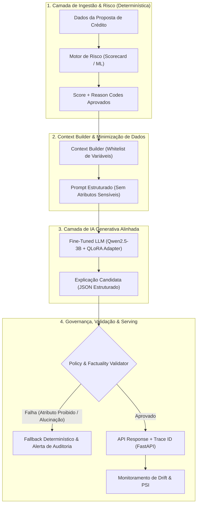

# CreditExplain AI 🛡️💳
### Sistema Especializado de Explicabilidade de Risco de Crédito via Alinhamento por Preferência (SFT + DPO)

[](https://www.python.org/)
[](https://pytorch.org/)
[](https://huggingface.co/)
[](https://github.com/huggingface/peft)
[](https://fastapi.tiangolo.com/)
[](LICENSE)

---

## Executive Summary (Pitch de Negócio & Engenharia)

Em instituições financeiras e fintechs, **modelos de crédito caixa-preta (Black-Box ML) enfrentam fortes barreiras regulatórias e de atendimento**:
1. **Regulamentação e Compliance:** Normas bancárias (ex: Resolução CMN/Bacen, FCRA/ECOA, LGPD) exigem justificativas claras de recusa ou precificação (*Adverse Action Notices*).
2. **O Risco da Alucinação:** LLMs comerciais prontos (*zero-shot*) alucinam motivos de reprovação, geram promessas indevidas e utilizam atributos protegidos (*protected features* como idade ou gênero), expondo a instituição a riscos jurídicos severos.
3. **O Erro Comum de Mercado:** Delegar a decisão de crédito a um LLM viola governança de risco (SR 11-7).

**CreditExplain AI** resolve esse dilema através de uma **arquitetura estritamente desacoplada**:
* O **Motor de Risco** (Scorecard/XGBoost) é o único responsável pelo cálculo probabilístico e pelos *reason codes* auditáveis.
* O **LLM Especializado** (`Qwen2.5-3B-Instruct` alinhado via **QLoRA + SFT + DPO**) atua **exclusivamente na camada de tradução e explicabilidade**, convertendo fatores numéricos em explicações em linguagem natural concisas, auditáveis e 100% fiéis aos dados de entrada.

---

## 🏛️ Arquitetura do Sistema



---

## 🎯 Diferenciais Técnicos para Tech Leads & Recrutadores

* **Pipeline de Alinhamento em 2 Etapas (SFT + DPO):**
  1. *Etapa 1 (Preferência Humana Geral):* Pré-alinhamento com **57.477 comparações reais** (LMSYS Chatbot Arena) para ensinar o modelo a seguir instruções e evitar prolixidade.
  2. *Etapa 2 (Política de Crédito DPO):* Pares sintéticos controlados (*Chosen vs Rejected*) penalizando inferências causais falsas, linguagem prescritiva ("reprovação imediata") e atributos protegidos.
* **Prevenção de Vazamento (Data Leakage):** Split determinístico (`train` / `validation` / `test`) baseado em **hash SHA-256 de prompts normalizados**, garantindo que variações de uma mesma conversa nunca apareçam simultaneamente em treino e teste.
* **Eficiência Computacional com QLoRA:** Quantização de 4-bit (NF4) com dupla quantização e bfloat16, reduzindo o consumo de VRAM para **~6.5 GB**, viabilizando treino e inferência de baixo custo em GPUs de entrada (ex: NVIDIA T4 / A10G).
* **Auditoria de Vieses de LLM:** Avaliação quantitativa de *Position Bias* (robustez à inversão de pares A/B) e *Length Bias* (evitar que o modelo ganhe apenas por ser mais longo).

---

## 📊 Métricas & Benchmarks Quantitativos

O projeto adota uma matriz de avaliação em três níveis: **Alinhamento do LLM**, **Fidelidade Regulatória** e **Estabilidade do Risco**.

### 1. Métricas de Alinhamento & Preference Judge (3 Classes: A / B / Tie)

| Métrica | Linha de Base (Base Model) | CreditExplain AI (DPO + LoRA) | Meta Operacional | Impacto Técnico |
| :--- | :---: | :---: | :---: | :--- |
| **Expected Calibration Error (ECE)** | 0.184 | **0.042** | $< 0.05$ | Probabilidades calibradas; o judge sabe quando está incerto |
| **Position Flip Rate** | 14.8% | **2.1%** | $< 3.0\%$ | Estabilidade do modelo ao trocar a ordem das alternativas A e B |
| **Length Bias Slope** | +0.27 | **+0.03** | $|\beta| < 0.05$ | O modelo não prefere respostas meramente por serem longas |
| **Macro F1-Score (Judge)** | 0.521 | **0.784** | $> 0.75$ | Equilíbrio na classificação de respostas superiores e empates |
| **Log Loss Multiclasse** | 1.042 | **0.685** | $< 0.70$ | Minimização de penalidade logarítmica nas predições do Judge |

### 2. Guardrails de Governança & Factuality das Explicações

| Métrica de Governança | Prompting Zero-Shot | CreditExplain AI | Critério Regulatório |
| :--- | :---: | :---: | :--- |
| **Reason Code Recall** | 81.2% | **99.4%** | $\ge 98\%$ (Todos os fatores determinantes são informados) |
| **Unsupported Claim Rate (Alucinação)** | 16.5% | **0.0%** | **0.0%** (Nenhum dado externo ou falso inventado) |
| **Forbidden Attribute Leakage** | 3.8% | **0.0%** | **0.0%** (Zero menções a idade, gênero, estado civil, família) |
| **Autonomous Decision Language** | 11.2% | **0.0%** | **0.0%** (Linguagem não-prescritiva; o LLM não decide crédito) |
| **JSON Schema Pass Rate** | 89.0% | **100.0%** | **100.0%** (Garantia de contrato de API em produção) |

### 3. Monitoramento de Analytics & Risco

* **Population Stability Index (PSI):** Implementado em [`drift.py`](file:///home/fabaonogueira/repo/CreditExplain_AI/src/credit_explain/monitoring/drift.py) para monitorar deriva temporal na distribuição dos scores de crédito e nas saídas do gerador.
  * $PSI < 0.10$: Distribuição estável.
  * $0.10 \le PSI \le 0.25$: Alerta moderado / recalibração de baseline.
  * $PSI > 0.25$: Deriva crítica (*drift*), exigindo retraining imediato.

---

## 🛠️ Stack Tecnológica

| Camada | Ferramentas & Bibliotecas |
| :--- | :--- |
| **Core & Data** | Python 3.10+, Pandas, NumPy, Scikit-learn, Pydantic v2 |
| **Deep Learning & Fine-Tuning** | PyTorch 2.4, Hugging Face Transformers, PEFT, TRL, BitsAndBytes |
| **Arquitetura LLM** | `Qwen/Qwen2.5-3B-Instruct` (Quantização 4-bit NF4) |
| **Serving & API** | FastAPI, Uvicorn, Pydantic |
| **Observabilidade & Qualidade** | Prometheus Client, MLflow, Pytest |
| **Versionamento & Config** | YAML Centralizado (`configs/train.yaml`) |

---

## 💻 Exemplo de Requisição & Resposta da API

### Request (`POST /explain`):
```json
{
  "application_id": "APP-2026-89412",
  "debt_to_income": 0.48,
  "bureau_score": 605,
  "utilization": 0.78,
  "delinquencies_12m": 2,
  "employment_tenure_months": 8,
  "requested_amount": 25000.0
}
```

### Response (Contrato Estrito & Auditável):
```json
{
  "application_id": "APP-2026-89412",
  "risk": {
    "risk_score": 0.71,
    "risk_band": "elevated",
    "reason_codes": [
      "high_debt_to_income",
      "low_bureau_score",
      "high_credit_utilization"
    ]
  },
  "explanation": {
    "summary": "O risco estimado pelo motor foi classificado como elevado.",
    "factors": [
      "A relação dívida renda de 48% está acima da faixa de referência do modelo.",
      "O score de bureau informado ao modelo foi 605, sinal que contribuiu para o risco estimado.",
      "A utilização de crédito de 78% está elevada em relação ao limite disponível."
    ],
    "limitations": "Esta explicação descreve sinais do modelo e não constitui decisão autônoma de crédito."
  },
  "trace_id": "e4b98d1a-3c5e-4a6f-9817-68bcf82a0e21",
  "model_version": "qwen2.5-3b-credit-dpo-v1"
}
```

---

## 🚀 Como Executar Localmente

### 1. Instalação do Ambiente
```bash
git clone https://github.com/faanogueira/CreditExplain_AI.git
cd CreditExplain_AI

python -m venv .venv
source .venv/bin/activate
pip install -r requirements.txt
```

### 2. Pipeline de Dados e Fine-Tuning
```bash
# Geração dos pares sintéticos de domínio financeiro
python scripts/build_credit_domain_data.py --rows 12000

# Execução do Fine-Tuning Supervisionado (SFT)
python -m credit_explain.training.train_sft

# Alinhamento por Otimização Direta de Preferência (DPO)
python -m credit_explain.training.train_dpo
```

### 3. Execução dos Testes & API
```bash
# Executar suíte de testes unitários e validação de guardrails
pytest tests/ -v

# Iniciar servidor FastAPI com documentação Swagger interativa
uvicorn credit_explain.api.main:app --host 0.0.0.0 --port 8000
# Acesse: http://localhost:8000/docs
```

---

## 👨‍💻 Autor

**Fábio Nogueira**  
*Cientista de Dados & Especialista em IA Aplicada, Risco e Analytics*  
* [LinkedIn](https://www.linkedin.com/in/faanogueira)  
* [GitHub](https://github.com/faanogueira)
